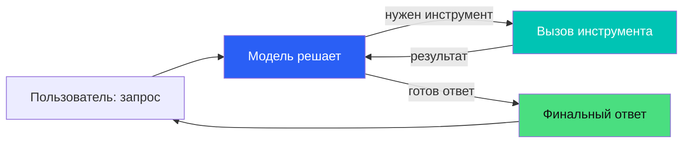
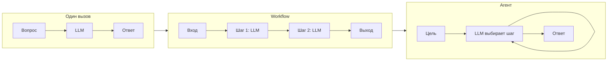
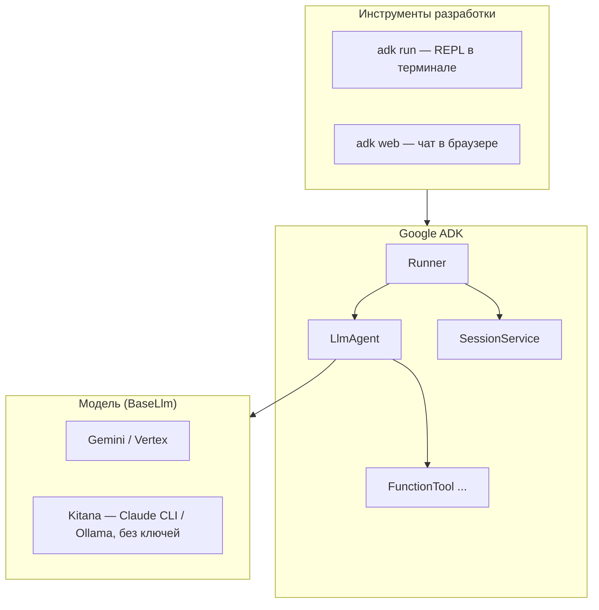
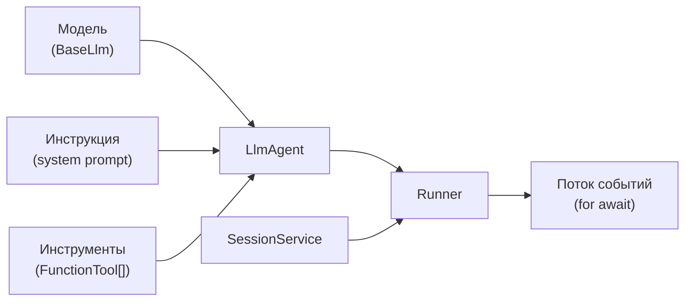
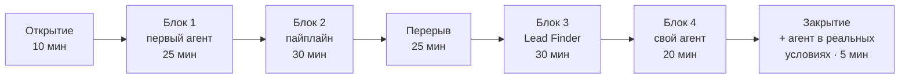

# Вступление к воркшопу — сценарий слайдов (RU)

Черновик содержания для вступительной части (до практики). Слайды сами будут
на английском (см. `slides-app`), этот файл — русский сценарий/тезисы, по
которым они верстаются. Три темы, как договорились: теория агентов → почему
ADK / что такое Google ADK → план воркшопа. Никакой практики/кода из волн
1–3 сюда не входит, только вступление.

---

## Тема 1 — Что такое агент

### Тезис

Три уровня того, что можно сделать с LLM — от простого к сложному:

1. **Один вызов** — вопрос → ответ. Классификация, суммаризация, извлечение
   данных. Ты решаешь, что делать с ответом.
2. **Workflow** — ты написал код, который дёргает LLM несколько раз по
   фиксированному сценарию (`шаг 1 → шаг 2 → шаг 3`). Порядок шагов
   зафиксирован тобой, не моделью.
3. **Агент** — ты отдаёшь модели список инструментов и цель. Модель САМА
   решает, какой инструмент вызвать, в каком порядке, и когда остановиться.
   Порядок шагов не зафиксирован — его выбирает модель на каждой итерации.

Агент — это НЕ конкретная технология, это **архитектурный паттерн**: цикл
"модель решает → вызов инструмента → результат обратно модели → повтор",
пока модель не решит, что задача выполнена.

### Из чего состоит агент (компоненты)

- **Модель** (LLM) — мозг, принимает решения.
- **Инструкция / system prompt** — контракт поведения, не подсказка (см.
  эксперимент в конце волны 1: без инструкции агент теряет консистентность).
- **Инструменты (tools)** — функции, которые модель может вызвать
  (`FunctionTool` в ADK — оборачивает обычную функцию в описание, понятное
  модели: имя, параметры, когда вызывать).
- **Память / состояние (session)** — история сообщений и промежуточные
  данные между итерациями цикла.
- **Runner / цикл (loop)** — код, который на каждой итерации: спрашивает
  модель → если модель просит вызвать инструмент, вызывает его и кормит
  результат обратно → если модель вернула финальный ответ, останавливается.
  Обычно есть предохранитель — лимит на число итераций.

### Диаграмма — цикл агента

### Диаграмма — три уровня сложности

*(порядок шагов в L2 фиксирован кодом; в L3 модель сама решает, сколько раз
пройти цикл и в каком порядке — это и есть разница между workflow и агентом)*

---

## Тема 2 — Почему ADK, что такое Google ADK

### Проблема, которую решает ADK

Цикл агента (модель → инструмент → модель → ...) звучит просто, но писать его
вручную для каждого проекта — это каждый раз переизобретать:

- парсинг ответа модели (обычный текст vs "я хочу вызвать функцию X с
  аргументами Y" — у каждого провайдера свой формат);
- хранение истории сообщений и состояния между итерациями (session);
- поток событий наружу (что показывать пользователю по мере работы агента —
  частичный текст, вызов инструмента, финальный ответ);
- защиту от бесконечного цикла;
- композицию нескольких агентов друг с другом (агент А передаёт результат
  агенту Б).

**Google ADK** (Agent Development Kit) — фреймворк, который даёт готовые
кирпичи для всего этого, чтобы писать логику агента, а не эту "сантехнику".

### Кирпичи ADK

- `LlmAgent` — один агент: модель + инструкция + список инструментов.
- `Runner` — исполняет цикл агента, отдаёт поток событий (`for await`).
- `SessionService` — хранит историю диалога между запросами.
- `FunctionTool` — оборачивает обычную функцию в инструмент, понятный модели.
- `SequentialAgent` / `ParallelAgent` — композиция нескольких агентов
  (цепочкой или одновременно).
- `BaseLlm` — абстракция над "какая модель отвечает". По умолчанию это
  Gemini, но это именно то место, куда на воркшопе подключается Kitana —
  один и тот же `LlmAgent`, разный `BaseLlm` под капотом.

### Диаграмма — слои

### Диаграмма — сборка одного агента

---

## Тема 3 — Что делаем на воркшопе (план)

### Тезис

Формат: ~2ч25 с перерывом в середине, офлайн, для технарей. Идём от самого простого агента до
рабочего кейса — четыре блока, каждый следующий добавляет ровно одну новую
идею к предыдущему, не переписывая то, что уже работало. В конце смотрим
на агента не в игрушечных условиях, а встроенным в реальный процесс (n8n).

Реальная раскладка по времени — `context/02-workshop-plan.md`, сверена с
`context/16-workshop-master-plan.md` (там же зафиксировано: Kitana —
**не отдельный блок**, а один из 4 равноправных провайдеров под ADK, наравне
с Gemini/Ollama/Claude API; выбор провайдера не меняет архитектуру блоков).

| Блок | Что нового добавляем | Время |
|---|---|---|
| Открытие | архитектура на схеме, вопросы залу, короткое демо Kitana ("прокси без ключей на экране") | 10 мин |
| Блок 1 — первый агент | `LlmAgent` → добавляем `FunctionTool` | 25 мин |
| Блок 2 — пайплайн | эксперимент "один агент vs несколько", `SequentialAgent` | 30 мин |
| Перерыв | еда, разминка, вопросы один-на-один | 25 мин |
| Блок 3 — Lead Finder | практический кейс, дебаг через `adk web` | 30 мин |
| Блок 4 — свой агент | берёшь задачу из своей работы, пишешь агента сам | 20 мин |
| Закрытие | по кругу — что удивило, плюс смотрим агента в реальных условиях | 5 мин |

*(10+25+30+25+30+20+5 = 145 мин ≈ 2ч25 — перерыв добавлен сверху, а не
за счёт урезания блоков; это уже не "ровно 2 часа", и слайд честно об
этом говорит, а не подгоняет цифры)*

### Диаграмма — прогресс по блокам

### Что остаётся неизменным во всех блоках

- Один и тот же `LlmAgent`/`Runner` из ADK — меняется только то, что стоит
  за `BaseLlm` (Gemini, Kitana, Ollama, Claude API — выбор не архитектурный).
- Один и тот же цикл агента из темы 1: модель решает → инструмент →
  результат обратно → повтор.
- В любой момент можно посмотреть на агента живьём через `adk web`
  (браузер) или `adk run` (терминал) — не только через свой `main()`.

---

## Как это ляжет на слайды (черновая раскладка)

1. `TitleSlide` — тема воркшопа, докладчик.
2. `SectionSlide` — "Часть 1: Что такое агент".
3. `ContentSlide` — три уровня (один вызов / workflow / агент), текст.
4. `ContentSlide` — диаграмма цикла агента (mermaid → перерисовать SVG/JSX).
5. `ContentSlide` — из чего состоит агент (компоненты, список).
6. `SectionSlide` — "Часть 2: Google ADK".
7. `ContentSlide` — проблема, которую решает ADK.
8. `ContentSlide` — кирпичи ADK (список + диаграмма слоёв).
9. `ContentSlide` — диаграмма сборки одного агента.
10. `SectionSlide` — "Часть 3: План воркшопа".
11. `ContentSlide` — таблица блоков (Открытие/Блок 1–4/Закрытие), время сходится в 2 часа.
12. `ContentSlide` — диаграмма прогресса по блокам.
13. `ContentSlide` — что остаётся неизменным (мостик к практике).
